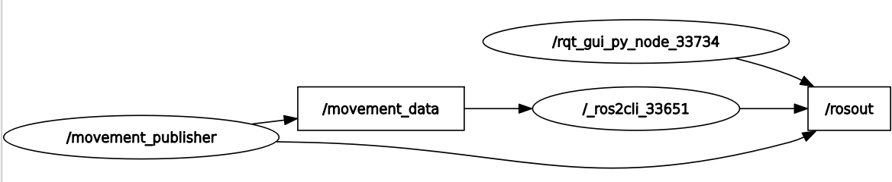

# ROS2 package for movement data publisher node

This publisher node will send a message of type `CircleMovement` to the topic, and will eventually be received and processed by a subscriber node.

The message consists of two float values, indicating the linear-x-direction movement and angular-z-direction movement respectively.

In this node, user can input float values from the keyboard to update the data for movement messages. In order not to block the execution of our main publisher, we will separate the input feature into an independent thread using `std::thread`.

The `rqt_graph` representation of this node and `movement_topic` is as follow:
